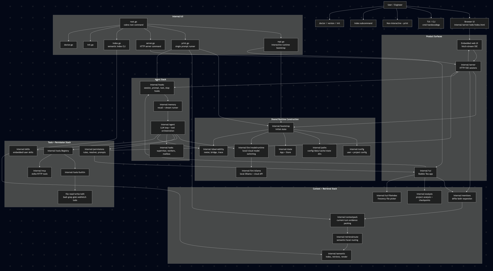
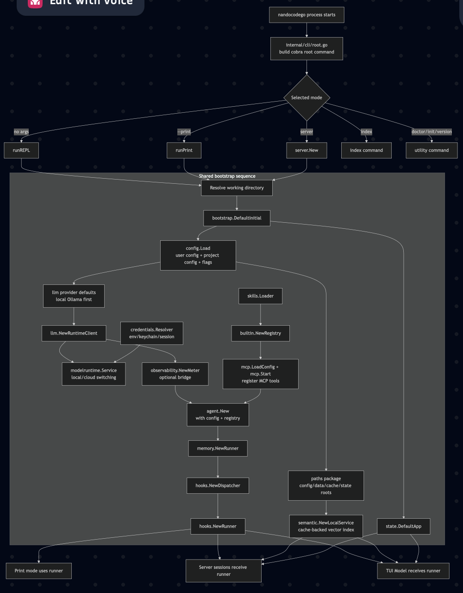
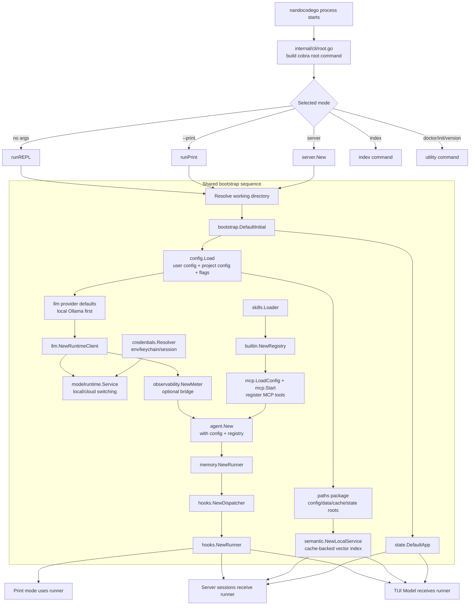
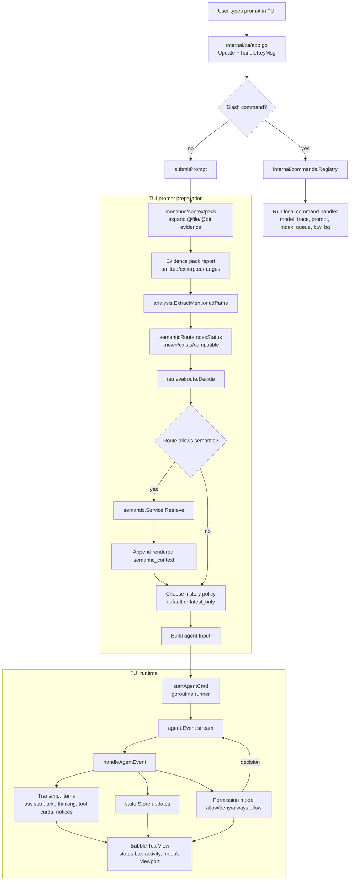
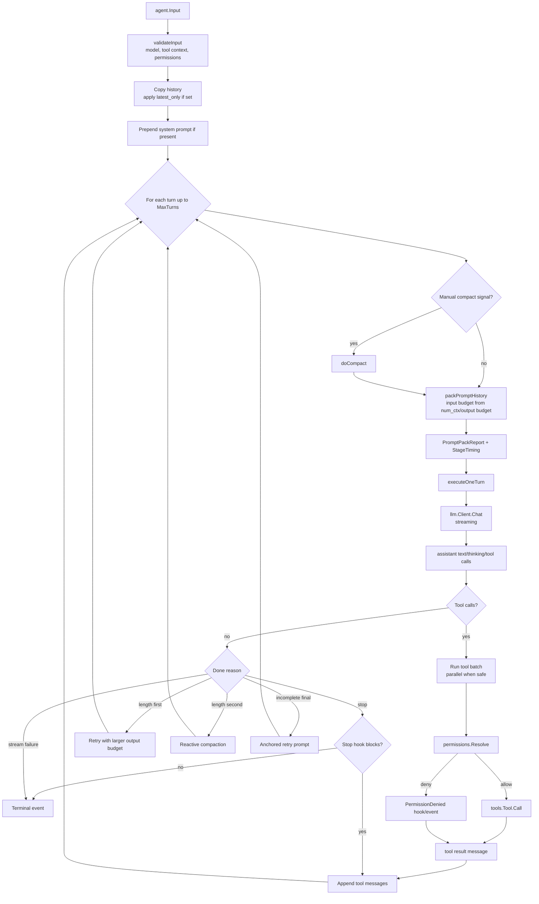
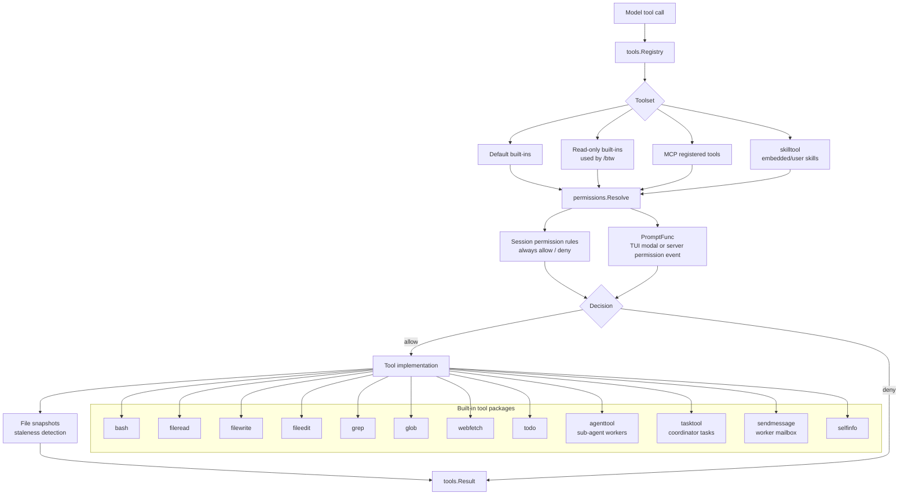
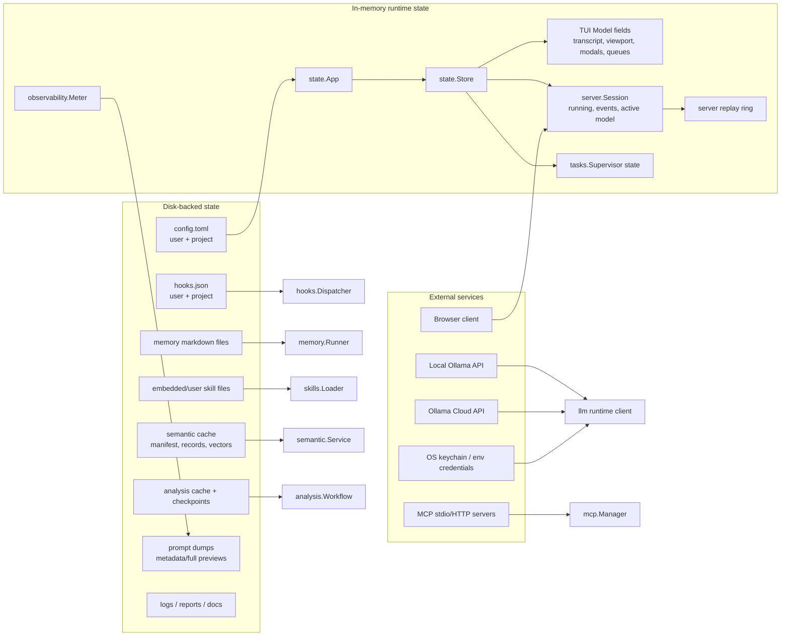

# Application Architecture Flowchart

Date: 2026-06-23

Module path: `github.com/FernasFragas/Nandocode`

This document maps the current application architecture as implemented in the
Go codebase. The diagrams are intentionally split by concern so they remain
readable in GitHub Mermaid rendering.

## 1. Whole-Application System Map

```mermaid
flowchart TD
  User[User / Engineer]
  Browser[Browser UI<br/>internal/server/web/index.html]
  Terminal[TUI / CLI<br/>cmd/nandocodego]
  Print[Non-interactive --print]
  IndexCLI[index subcommand]
  Doctor[doctor / version / init]

  User --> Browser
  User --> Terminal
  User --> Print
  User --> IndexCLI
  User --> Doctor

  subgraph CLI["internal/cli"]
    Root[root.go<br/>cobra root command]
    Repl[repl.go<br/>interactive runtime bootstrap]
    PrintRunner[print.go<br/>single prompt runner]
    ServerCmd[server.go<br/>HTTP server command]
    IndexCmd[index.go<br/>semantic index CLI]
    InitCmd[init.go]
    DoctorCmd[doctor.go]
  end

  subgraph Runtime["Shared Runtime Construction"]
    Bootstrap[internal/bootstrap<br/>initial state]
    Config[internal/config<br/>user + project config]
    Paths[internal/paths<br/>config/data/cache/state dirs]
    State[internal/state<br/>App + Store]
    LLMRuntime[internal/llm/modelruntime<br/>local/cloud model switching]
    Ollama[internal/llm/ollama<br/>local Ollama + cloud API]
    Meter[internal/observability<br/>meter, bridge, trace]
  end

  subgraph ProductSurfaces["Product Surfaces"]
    TUI[internal/tui<br/>Bubble Tea app]
    Server[internal/server<br/>HTTP/SSE sessions]
    WebUI[Embedded web UI<br/>fetch-stream SSE]
  end

  subgraph AgentStack["Agent Stack"]
    Hooks[internal/hooks<br/>session, prompt, tool, stop hooks]
    Memory[internal/memory<br/>recall + dream runner]
    Agent[internal/agent<br/>LLM loop + tool orchestration]
    TaskSup[internal/tasks<br/>supervisor, workers, mailbox]
  end

  subgraph ContextStack["Context + Retrieval Stack"]
    Mentions["internal/mentions<br/>@file/@dir expansion"]
    ContextPack[internal/contextpack<br/>current-turn evidence packing]
    RetrievalRoute[internal/retrievalroute<br/>semantic/local routing]
    Semantic[internal/semantic<br/>index, retrieve, render]
    Analysis[internal/analysis<br/>project analysis + checkpoints]
    FileIndex[internal/tui/fileindex<br/>frecency file picker]
  end

  subgraph ToolsStack["Tools + Permission Stack"]
    Tools[internal/tools.Registry]
    Builtin[internal/tools/builtin]
    ToolImpls[file read/write/edit<br/>bash grep glob webfetch todo]
    Permissions[internal/permissions<br/>rules, resolver, prompts]
    MCP[internal/mcp<br/>stdio/HTTP tools]
    Skills[internal/skills<br/>embedded/user skills]
  end

  Root --> Repl
  Root --> PrintRunner
  Root --> ServerCmd
  Root --> IndexCmd
  Root --> InitCmd
  Root --> DoctorCmd

  Repl --> Bootstrap
  PrintRunner --> Bootstrap
  ServerCmd --> Server
  Server --> Bootstrap
  IndexCmd --> Semantic

  Bootstrap --> Config
  Bootstrap --> Paths
  Bootstrap --> State
  Bootstrap --> LLMRuntime
  LLMRuntime --> Ollama
  Bootstrap --> Meter

  Repl --> TUI
  Server --> WebUI
  Browser --> WebUI
  WebUI --> Server

  TUI --> Mentions
  Server --> Mentions
  PrintRunner --> ContextPack
  Mentions --> ContextPack
  ContextPack --> RetrievalRoute
  RetrievalRoute --> Semantic
  TUI --> Analysis
  TUI --> FileIndex

  TUI --> Hooks
  Server --> Hooks
  PrintRunner --> Hooks
  Hooks --> Memory
  Memory --> Agent
  Agent --> LLMRuntime
  Agent --> Tools
  Tools --> Builtin
  Builtin --> ToolImpls
  Tools --> MCP
  Agent --> Permissions
  Permissions --> TUI
  Permissions --> Server
  Agent --> TaskSup
  Agent --> Meter
  Agent --> Skills
```





## 2. Startup And Runtime Assembly





## 3. Interactive TUI Prompt Flow



## 4. Browser And HTTP Server Flow

```mermaid
flowchart TD
  Browser[Browser]
  StaticUI[GET /<br/>embedded rich UI]
  CreateSession[POST /v1/sessions]
  SessionRegistry[sessionRegistry]
  Session[server.Session]
  EventStream[GET /v1/sessions/:id/events<br/>SSE with replay + heartbeat]
  PostPrompt[POST /v1/sessions/:id/messages]
  PermissionPost[POST /v1/sessions/:id/permissions/:request_id]
  ModelPost[POST /v1/sessions/:id/model]
  TreeGet[GET /v1/sessions/:id/tree]
  ModelsGet[GET /v1/models]

  Browser --> StaticUI
  Browser --> CreateSession --> SessionRegistry --> Session
  Browser --> EventStream --> Session
  Browser --> PostPrompt --> Session
  Browser --> PermissionPost --> Session
  Browser --> ModelPost --> Session
  Browser --> TreeGet
  Browser --> ModelsGet

  subgraph ServerGuards["Server guards"]
    Auth[Bearer token middleware<br/>when --token set]
    BindPolicy[Non-loopback bind requires token]
    RateLimit[Rate limiter + max sessions]
    RecentIDs[Duplicate message_id guard]
    SessionLimit[Idle sweep + delete session]
  end

  StaticUI --> Auth
  CreateSession --> RateLimit
  PostPrompt --> RecentIDs
  SessionRegistry --> SessionLimit

  subgraph ServerPromptPrep["Server prompt preparation"]
    Pack[contextpack.BuildCurrentTurnPrompt]
    RouteStatus[semanticRouteIndexStatus]
    Route[retrievalroute.Decide]
    Sem{semantic allowed?}
    SemRetrieve[semantic.Service.Retrieve]
    Input[agent.Input]
  end

  PostPrompt --> Pack --> RouteStatus --> Route --> Sem
  Sem -->|yes| SemRetrieve --> Input
  Sem -->|no| Input
  Input --> RunAgent[Session.runAgent]

  subgraph SSEEvents["Server event translation"]
    AgentEvent[agent.Event]
    SessionEvent[SessionEvent envelope<br/>id/type/session_id/data]
    Ring[Replay ring buffer]
    Subscribers[SSE subscribers]
    WebRender[Browser eventPayload(msg)<br/>render assistant/tool/permission/terminal]
  end

  RunAgent --> AgentEvent --> SessionEvent --> Ring --> Subscribers --> WebRender
  PermissionPost -->|resolve request| Session
  ModelPost --> modelruntime[modelruntime.Switch]
  TreeGet --> filepathwalk[file tree response]
  ModelsGet --> modelruntimeList[modelruntime.ListLocal]
```

## 5. Agent Turn And Tool Execution Loop



## 6. Context, Mentions, Retrieval, And Analysis

```mermaid
flowchart TD
  Prompt[Raw user prompt]
  MentionParse[mentions.Parse / intent detection]
  ListingIntent{Listing/tree intent?}
  Expand[contextpack.BuildCurrentTurnPrompt]
  FileRead[fileread/range reads]
  DirWalk[dirwalk / file tree]
  EvidenceBudget[Prompt/file byte budgets]
  EvidenceReport[EvidencePackReport<br/>packed, excerpted, omitted]
  PromptWithEvidence[Prompt with files/dirs/ranges]

  Prompt --> MentionParse --> ListingIntent --> Expand
  Expand --> FileRead
  Expand --> DirWalk
  FileRead --> EvidenceBudget
  DirWalk --> EvidenceBudget
  EvidenceBudget --> EvidenceReport --> PromptWithEvidence

  subgraph Retrieval["Semantic retrieval route"]
    RouteInput[retrievalroute.Input<br/>prompt, attachment policy, current paths, index status]
    RouteDecision[Decision<br/>skip/local/search/semantic light/full]
    IndexStatus[semantic.Status<br/>exists/compatible]
    Retrieve[semantic.Retrieve]
    Store[semantic.Store<br/>manifest, records, vectors]
    Embed[LLM embedder<br/>query embedding]
    Score[hybrid scoring<br/>semantic + lexical + frecency]
    Render[renderRetrievedContext]
  end

  PromptWithEvidence --> RouteInput
  IndexStatus --> RouteInput --> RouteDecision
  RouteDecision -->|semantic| Retrieve
  Retrieve --> Store
  Retrieve --> Embed
  Store --> Score
  Embed --> Score
  Score --> Render --> PromptWithSemantic[Prompt + semantic_context]
  RouteDecision -->|skip/local only| PromptWithoutSemantic[Prompt without semantic_context]

  subgraph AnalysisWorkflow["Project analysis workflow"]
    AnalyzeCmd[/analyze-project]
    FileIndex[fileindex ranked files]
    Chunker[analysis chunker]
    Summary[deterministic summaries]
    Ledger[analysis ledger]
    Checkpoint[checkpoint save/load/continue]
  end

  AnalyzeCmd --> FileIndex --> Chunker --> Summary --> Ledger --> Checkpoint
```

## 7. Tool Registry, Permissions, And Execution Boundaries



## 8. State, Storage, And Persistence Surfaces



## 9. Observability And Diagnostics Flow

```mermaid
flowchart TD
  AgentEvent[agent.Event]
  Meter[observability.Meter]
  Bridge[observability.Bridge<br/>optional external bridge]
  Trace[RunTrace]
  PromptDump[agent prompt dump store]
  TUIRender[TUI transcript/status]
  ServerEvent[server.SessionEvent]
  BrowserRender[Browser status/cards]
  Commands[slash commands]

  AgentEvent --> Meter
  AgentEvent --> TUIRender
  AgentEvent --> ServerEvent --> BrowserRender
  Meter --> Trace
  Meter --> Bridge
  PromptDump --> Commands
  Trace --> Commands

  Commands --> TraceLast[/trace last<br/>timings, route, prompt/evidence pack]
  Commands --> PromptLast[/prompt last<br/>request metadata, options, evidence]
  Commands --> Queue[/queue]
  Commands --> Index[/index status/build/refresh]

  subgraph EventTypes["High-signal event types"]
    Thinking[assistant_thinking_delta]
    Text[assistant_text_delta]
    ToolStart[tool_use_start]
    ToolResult[tool_use_result]
    Permission[permission_request]
    Stage[stage_timing / semantic_stage_timing]
    Pack[prompt_pack_report]
    Route[retrieval_route_decided]
    Semantic[semantic_retrieval / semantic_skipped]
    Retry[retry_notice]
    Terminal[terminal]
  end

  AgentEvent --> Thinking
  AgentEvent --> Text
  AgentEvent --> ToolStart
  AgentEvent --> ToolResult
  AgentEvent --> Stage
  AgentEvent --> Pack
  AgentEvent --> Retry
  AgentEvent --> Terminal
  ServerEvent --> Permission
  ServerEvent --> Route
  ServerEvent --> Semantic
```

## 10. Product Flow Summary

```mermaid
flowchart LR
  Intent[User intent] --> Surface{Surface}
  Surface -->|Terminal interactive| TUI
  Surface -->|Browser local app| Server
  Surface -->|Automation| Print
  Surface -->|Index maintenance| Index

  TUI --> Prep[Prompt/context preparation]
  Server --> Prep
  Print --> Prep
  Index --> SemanticBuild[Semantic build/refresh/status]

  Prep --> AgentRun[Agent run]
  AgentRun --> Model[Ollama local/cloud model]
  AgentRun --> Tools[Tools + permissions]
  Tools --> Workspace[Workspace files/processes/web/MCP]
  Model --> Response[Assistant response]
  Tools --> Response
  Response --> SurfaceOutput{Output}
  SurfaceOutput -->|TUI| Transcript[TUI transcript + status]
  SurfaceOutput -->|Browser| SSE[Browser SSE rendering]
  SurfaceOutput -->|Print| Stdout[stdout/json]
  SurfaceOutput -->|Diagnostics| TracePrompt[/trace and /prompt]
```
